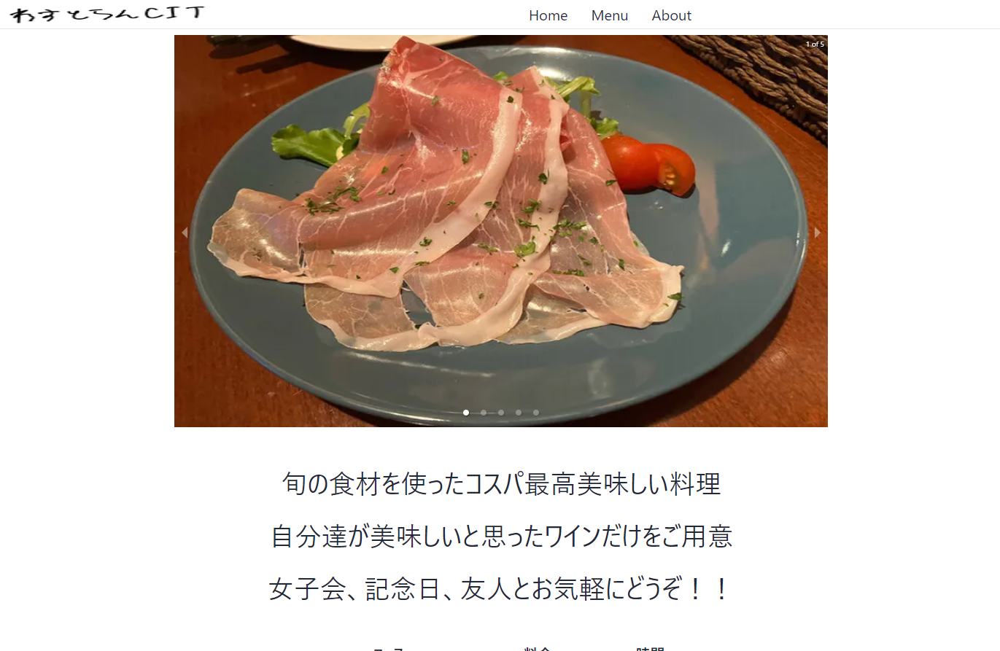
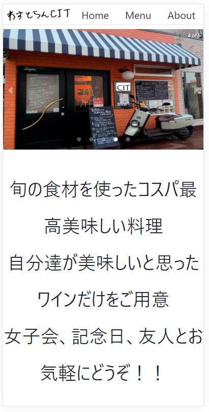

# ビジュアルコンテンツデザイン提出資料

## 成果物
[https://vcdw.irumaru.net/](https://vcdw.irumaru.net/)

## 概要
- レスポンシブデザインにすることで、様々な端末からでも閲覧しやすくしました。  
- Headerに全てのページに飛べるリンクを設置することで、空腹時に高速にメニューを見れるようにしました。  
- 駅の近くなどの通信環境が悪い場所でも高速に読み込めるようにしました。  

## レスポンシブデザイン
|    PC   |スマートフォン|
|:--------:|:--------:|
| | |

## パフォーマンス
|    URL    |    PC   |スマートフォン|
|:--------:|:--------:|:--------:|
| / | | |
| /menu | | |

## 使用ツールと目的
### Astro(高速な読み込みを実現)
　飲食店のWebサイトは、通信環境の悪い場所で高速に読み込めることが重要であると考えます。また、SNSなどと異なりページ内の推移もそれほど多くないと考えます。  
　そこで、読み込み時のファイルサイズの節約と、読み込み後のレンダリング時間の節約のために、SSGを採用しているAstroを使用しました。  
　また、AstroのSSGでは画像の最適化(webp)や、不要なJavaScriptの削減や、テキストファイルの不要な空白の削除を自動で行います。  

### Tailwind CSS & DaisyUI(手軽にオリジナリティの高いサイトを作成)

### React(react-responsive-carouselを使用することで手軽にがルーセルを実装)

### Cloudflare CDN(よりユーザに近いEdgeからデータを配信)

### Github Pages & Github Actions(簡単にデプロイ)